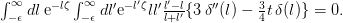

# CRNN

A Neural Network to convert images of latex formula into there corrseponding code.

## Background

An Optical character regcogniton is the conversion of images of typed, handwritten or printed text into machine-encoded text

### Showcase

Here is an example of an image:

